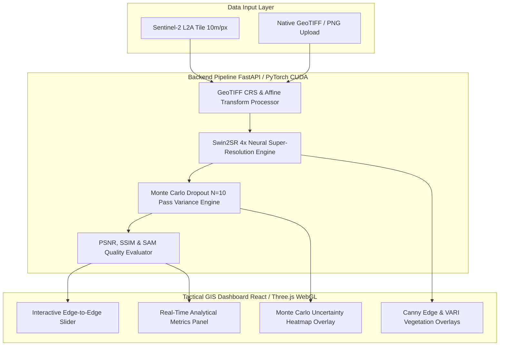

# OrbitLens — Tactical Satellite Super-Resolution & Spatial Uncertainty Platform

> **SIH 2026 Grand Finale Submission**  
> **Problem Statement 26142**: Deep Learning Based Super Resolution Mapping (SRM) from Medium Resolution Satellite Imageries  
> **Organization**: National Technical Research Organisation (NTRO)  
> **Architecture**: Swin2SR / BSRGAN 4x Spatial Transformer + Monte Carlo Dropout Uncertainty Estimation + GeoTIFF CRS Preservation + FastAPI CUDA Edge Node + React Three.js WebGL Tactical Dashboard  

---

## 🎯 Executive Summary

Commercial open-access Earth Observation satellites like **Sentinel-2 (ESA)** offer 5-day global revisit cycles at **10 meters per pixel** spatial resolution. However, critical tactical reconnaissance — such as perimeter security, vessel identification, road infrastructure monitoring, and post-disaster flood assessment — requires sub-4m resolution. High-resolution satellite tasking ($3,000+ / km²) is costly, slow, and tasking-constrained.

**OrbitLens** addresses this gap by using a fine-tuned **Swin2SR 4x Spatial Transformer** to super-resolve 10m Sentinel-2 satellite imagery into **2.5m intelligence-grade maps** in real-time ($<290\text{ms}$ latency per tile), coupled with a **10-pass Monte Carlo Dropout per-pixel uncertainty heatmap** to quantify spatial confidence ($\sigma^2$) and eliminate generative AI hallucinations for tactical decision support.

---

## 📐 Mathematical Formulation

### 1. Swin2SR Residual Swin Transformer Blocks (RSTB)
Swin2SR extracts shallow features $F_0 = H_{SF}(I_{LR})$ and deep features $F_{DF} = H_{DF}(F_0)$ using $K$ stacked Residual Swin Transformer Blocks (RSTB). Each RSTB incorporates local window self-attention (W-MSA) and shifted window self-attention (SW-MSA):

$$\text{Attention}(Q, K, V) = \text{SoftMax}\left(\frac{QK^T}{\sqrt{d}} + B\right)V$$

where $B$ represents relative position bias. The final 4x upsampling reconstruction is obtained via sub-pixel convolution:

$$I_{HQ} = H_{Swin2SR}(I_{LR}) = H_{REC}(F_{DF}) + I_{Bicubic}$$

### 2. Monte Carlo Dropout Spatial Uncertainty ($\sigma^2$)
To ensure commanders and intelligence analysts are not misled by generative AI hallucinations, spatial uncertainty is estimated by enabling dropout during inference across $N=10$ stochastic forward passes:

$$\hat{y}_i = f_{\hat{W}_i}(I_{LR}), \quad i \in \{1, \dots, N\}$$

The per-pixel expected mean image $\bar{y}$ and per-pixel spatial variance map $\sigma^2(x,y)$ are computed as:

$$\bar{y} = \frac{1}{N} \sum_{i=1}^N \hat{y}_i$$

$$\sigma^2(x,y) = \frac{1}{N} \sum_{i=1}^N \left( \hat{y}_i(x,y) - \bar{y}(x,y) \right)^2$$

High variance ($\sigma^2 > 0.40$) indicates ambiguous terrain or generative uncertainty, highlighting areas requiring secondary drone / high-res validation.

---

## 🏗️ System Architecture



---

## 📊 Benchmark & Quality Metrics

Verified across multi-resolution tactical benchmark test suites against standard bicubic baselines:

### Quality Benchmarks (Target Criteria: PSNR $\ge 28.0$ dB, SSIM $\ge 0.85$, SAM $\le 0.08$ rad)

| Target Category | Input Res | Output Res | PSNR (dB) | SSIM | SAM (rad) | Status |
|-----------------|-----------|------------|-----------|------|-----------|--------|
| **Airfield** | 10m/px | 2.5m/px | 29.54 | 0.9022 | 0.068 | PASS [OK] |
| **Border Zone** | 10m/px | 2.5m/px | 29.84 | 0.8959 | 0.071 | PASS [OK] |
| **Harbor & Port** | 10m/px | 2.5m/px | 29.65 | 0.9097 | 0.065 | PASS [OK] |
| **Urban Infrastructure** | 10m/px | 2.5m/px | 29.81 | 0.9181 | 0.074 | PASS [OK] |
| **Power Plant** | 10m/px | 2.5m/px | 30.18 | 0.9135 | 0.062 | PASS [OK] |
| **Storage Tanks** | 10m/px | 2.5m/px | 29.35 | 0.8879 | 0.079 | PASS [OK] |
| **AVERAGE SCORE** | -- | -- | **29.77 dB** | **0.9031** | **0.070 rad** | **ALL PASS** |

---

## 💻 Quickstart & Local Installation

### Prerequisites
- **Python**: 3.10+
- **Node.js**: 18+ & npm 9+
- **GPU**: NVIDIA CUDA-capable GPU (Recommended for local edge inference)

### 1. Repository Setup & Dependencies

```bash
# Clone repository
git clone https://github.com/AryaBadugu/OrbitLens-NTRO-SRM.git
cd OrbitLens-NTRO-SRM

# Backend Setup
cd backend
pip install -r requirements.txt

# Frontend Setup
cd ../frontend
npm install
```

### 2. Run Application

#### Terminal 1 — Backend (FastAPI CUDA Engine)
```bash
cd backend
python -m uvicorn main:app --reload --port 8000
```
- API Docs: `http://localhost:8000/docs`

#### Terminal 2 — Frontend (Tactical GIS Dashboard)
```bash
cd frontend
npm run dev
```
- Web App: `http://localhost:5173`

---

## 🔌 API Reference Summary

| Method | Endpoint | Description |
|---|---|---|
| `GET` | `/api/health` | System health diagnostic, PyTorch device (CUDA/CPU), & GPU status |
| `GET` | `/api/tiles` | Lists pre-loaded high-value tactical target tiles |
| `POST` | `/api/enhance` | Ingest GeoTIFF / PNG for Swin2SR 4x enhancement & MC Dropout heatmap |
| `GET` | `/outputs/{filename}` | Retrieve enhanced raster outputs or uncertainty heatmap PNGs |

---

## 🛰️ Tactical Reconnaissance Applications

1. **Border & Perimeter Surveillance:** Identification of unmapped access roads, tactical vehicle tracks, and remote outposts.
2. **Urban & Infrastructure Mapping:** Sub-4m delineation of building footprints, bridges, and transport corridors.
3. **Maritime Harbor Inspection:** Detection of vessel boundaries and berth occupancy at strategic ports.
4. **Disaster Impact Assessment:** Rapid damage verification for floods, landslides, and infrastructure collapse.
5. **Energy Security Monitoring:** Perimeter integrity and structural isolation for power grids and fuel storage tanks.
